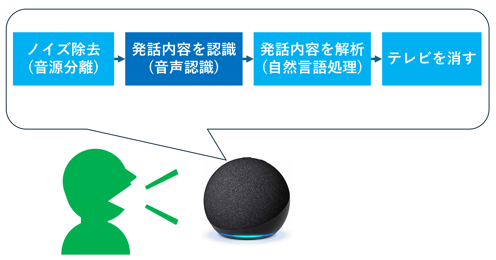
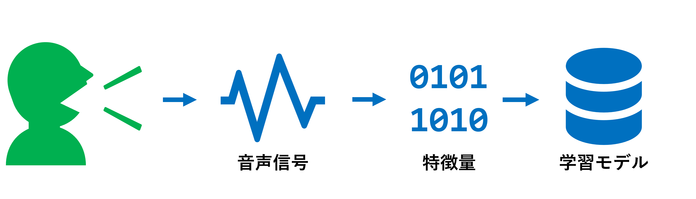

# 01 音声認識とは？

音声認識という単語を聞いたときに「音声を聞いて何かをする」というイメージはつくでしょう．  
しかし，実際の定義はどうでしょうか？しっかりと定義を確認しつつ，音声処理を身に着けてみましょう．

## 1-1 音声認識とは？どんなことに使えるのか？

音声認識とは「音声信号から発話内容を認識する技術」のことです．  
例えば Amazon が提供している Alexa を考えてみましょう．

「テレビを消して」という処理は中ではこんな感じで動いています．

この図を見ると分かるように，音という信号を文字起こしして次の処理に渡すことが音声認識であることが分かります．  
前処理や後処理が雑になると「すいません，よく分かりません」となってしまうことも理解できるかと思います．  
なので，音声認識以外の音源分離や自然言語処理も幅広い研究が行われています．

## 1-2 音声を認識するとは

音というのはどうやって聞こえているのか意識したことはありますか？  
耳の奥の方で振動して高い音や低い音が聞こえています．  
なので，音を周波数成分に分解することを考えます．

しかし，機械で音声を取り入れたとしても完全に再現することは不可能です．  
機械は 0 or 1 で物を見るので，完全になめらかな信号を認識することが難しいのです．  
そこで，音声信号を認識しやすい表現に変換してあげます．この表現のことを「特徴量」と呼びます．

では，モデルの中では何をやってるのかというと次の3つの物が中心に動いています．

1. 音響モデル : 特徴量を音素という音の最小単位として変換
2. 発音辞書 : 音素から単語の候補を探す
3. 言語モデル : 単語の候補から1つの単語に絞りこむ

ここで大事なことは「色んなモデルが必要になりすぎて考えることが多い」というところです．  
これを**ニューラルネットワーク**で表現することを目的とします．

実は現在では「End-to-End」モデルが主流であり，ここの3つの処理をまとめて行うことが出来ます．  
本資料では，End-to-Endモデルに行きつくまでの道のりを体験してもらいます．

## 1-3 本資料の構成

改めて目次を示します．

1. [音声認識とは？](./01intro.md) : このページです
2. [音声認識の基礎知識](./02basic.md) : 音声認識を確率を用いて理解する
3. [音声処理の基礎と特徴量抽出](./03features.md) : 特徴量の種類とフーリエ変換について理解する
4. [DPマッチングによる音声認識](./04dp.md) : DPマッチングという古典的な手法を学ぶ
5. [GMM-HMMによる音声認識](./05GMM-HMM.md) : マッチングではなく確率や推定を用いて実装する
6. [DNN-HMMによる音声認識](./06DNN-HMM.md) : 深層学習を用いた現在でも使われるモデルを実装する
7. [End-to-Endモデルによる連続音声認識](./07END2END.md) : 上位互換モデルを実装する

AIの勉強の時と同じように座学やコーディングを挟みますが，難しければ緩くするので気軽に相談してください！

## 【オマケ】取り組み方

- とりあえず資料を読んで要所を掴む
  - 知らない言葉を頭の中で説明できれば次に進む，という形で進めるといい
  - なお分からない場合は Google 先生や ChatGPT に聞いてみよう
- 取り組んだ記録として各ページで指定されている成果物を出してください
  - tasksフォルダの中に指定したファイルを作って置いておくこと
  - 出来れば GitHub に置いてほしい

## 課題

次の単語を自分なりの理解で説明してください．  
提出場所は`tasks/01intro/task1.txt`を用意しておいたのでそこに書き込むこと．

1. 音声認識
2. (音声の)特徴量
3. ニューラルネットワーク (本資料には載せてないので調べてみましょう)

[<- 目次ページ](../index.md) | [-> 02 音声認識の基礎知識](./02basic.md)
