# 02 音声認識の基礎知識

音声認識の基礎知識として確率のお勉強をしてもらいます．  
キーワードは以下の3つ！

1. 条件付き確率
2. ベイズの定理
3. 周辺化

多分，下の2つは習ってないはずなので詳しめに説明します．  
紙 2 枚程度とペンがあった方が分かりやすいです．

## 2-1 音声認識で用いる確率の基礎知識

専門用語がかなり登場するので，まずは簡単な例から始めましょう．

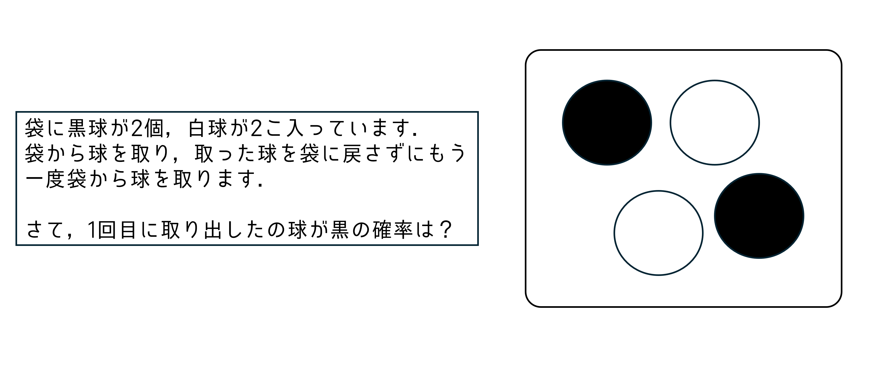

答えはもちろん 1/2 ですね．

ここで，この問題を関数のように入力と出力を持たせます．

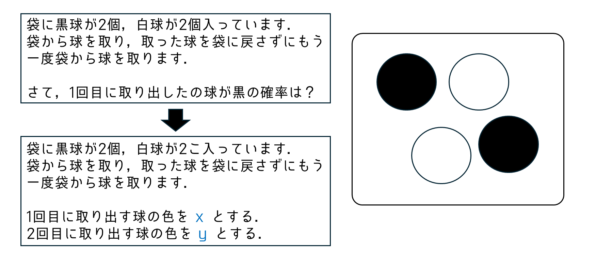

1回目と2回目に出る色を変数として表しました．  
この時の x や y の事を「確率変数」と言います．
この確率変数を使って関数みたいに表現します．  
先ほどの例だと **P(x=黒) = 1/2** のようになります．

さて，確率の言葉で3つほど覚えてもらいたい言葉があります．  
それが以下の通りです．

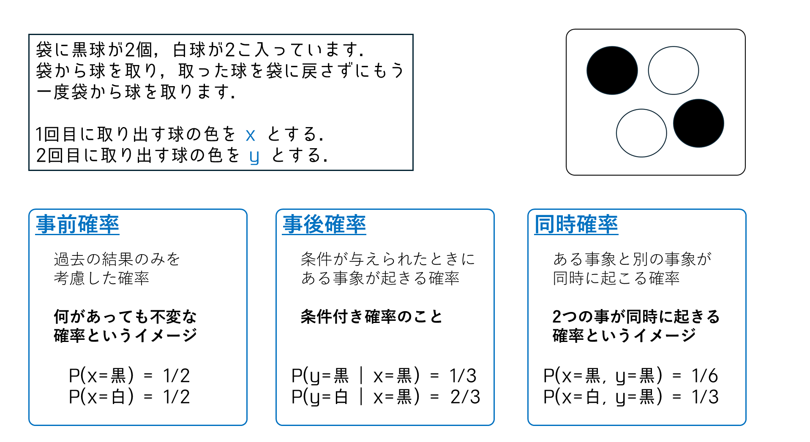

この単語は他の所でもバンバン出てくるので理解しておいてください．  
(これに関する課題も付けておいたので先にそっちをやってもいいかも [Task2-1](#task-2-1-確率の基礎知識) )

## 2-2 確率に関する基礎定理

ここでは，2-1で学んだ事前確率と事後確率，同時確率に関する定理を理解していきます．  
(こういう定理がつらつら続いてしまうのが機械学習系の勉強なので頑張ってついてきてください．)

定理を先に示しておきます．(定理の証明は[オマケ](#オマケ-定理の証明)のページに載せておきます．数学の授業ではないので．)

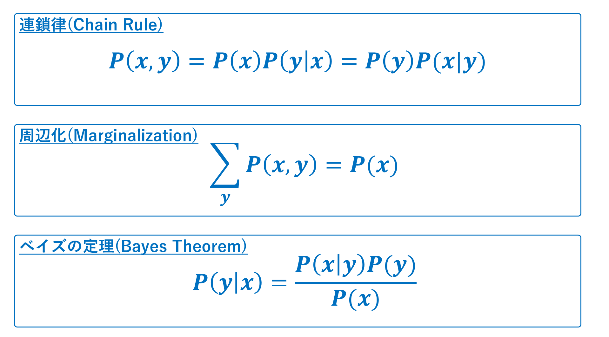

チェインルールは微分の世界にも出てきますが，確率の場合では同時確率を積の形に持ってくる定理を表します．  
(チェインの由来は何かを複数の積の形にするところから来ているっぽいです．律はルールのこと．)

周辺化は音声系の確率をやっていると出てくる**定義**です．同時確率の片方を全部求めて足し合わせたら事前確率になる，という定義だと思ってください．(イメージしやすい方の定理だと思います．)

そして，ベイズの定理は音声系だけでなく様々な所で登場するので使えるようにしておくと便利です．  
事後確率を逆転させて求めやすい方を利用する，という定理です．

---

ベイズの定理をどのように使うのかをもう少し詳しく説明します．

パラメータ$x$で表せるモデルとデータ$D$があるとします．  
このパラメータ$x$を最適化してあげたいです．
このモデルは確率変数で表すと$P(D|x)$となります．  
(データ$D$が与えられたときの$x$の事後確率)

いくつかの方法があります．  

1つ目は「最尤推定(さいゆうすいてい)」と呼ばれる方法で調べます．  
これは，$P(D|x)$が尤もらしい(=それっぽい)ものを選ぶ方法です．  
しかし，データ数が少ない場合に信頼できないことが問題として挙げられています．  
サイコロを2回振って1が2回出たら，最尤推定では1となるわけですが，本当にそうでしょうか？怪しいですよね．

ということで，2つ目の「MAP推定」と呼ばれる方法で調べます．  
これは，ベイズの定理を用いて$P(x|D)$を最大化する$x$を調べる方法です．  
$P(x|D)=\frac{P(D|x)P(x)}{P(D)}$と変換できます．  
$P(D)$は$x$に依存しないため，$P(D|x)P(x)$を最大化するような$x$を1つ選べば事足りるというわけです．

さらに，3つ目の方法「ベイズ推定」と呼ばれる方法があります．  
これは，MAP推定で$x$を1つ求める操作を$P(x|D)$の分布を直接求めてしまうものになってます．

正直，3つ目の「ベイズ推論」だけ覚えておけばいいと思います．  
それぞれの方法について課題を用意したので解いてから先に進んだ方がいいかもです．([Task2-2](#task-2-2-確率に関する基礎定理))

## 2-3 音響モデルと言語モデル

[1-2 音声を認識するとは](01intro.md#1-2-音声を認識するとは) で学習モデルの全体像を学びました．  
もう一度見てみると，学習モデルの中には「音響モデル」と「言語モデル」の二つのモデルが動いていることが分かります．  
これらのモデルを定式化するために，確率に関する基礎定理を適用します．

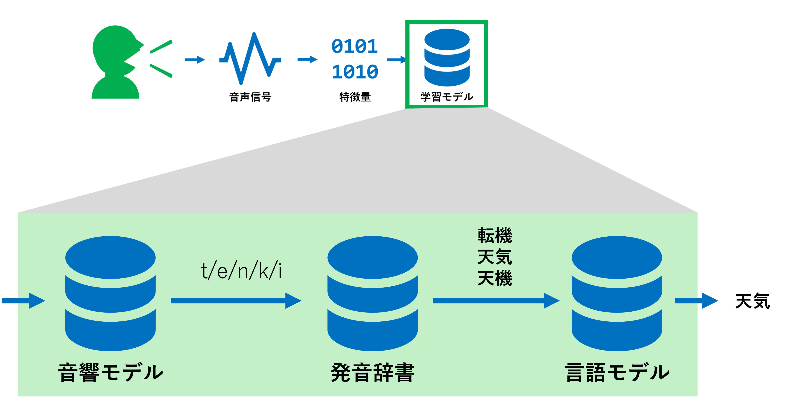

入力された音声というのはどんなものであるか分からないため，確率変数として定義しておきます．今回は$x$とします．  
そして，出力されるテキストもどんなものか分からないので，確率変数を$w$とします．  
音声$x$が入力されたという条件の下で最も出力される確率が高いテキスト列$\hat{w}$は以下のように定義できます．

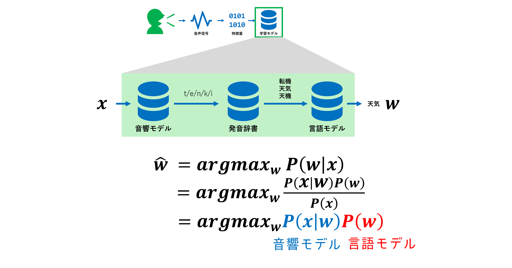

画像のように，$P(x|w)$を**音響モデル**，$P(w)$を**言語モデル**と呼びます．

ここで音響モデルの粒度を細かくします．具体的には音素単位にすることで融通を聞かせやすくします．  
例として「私はペコパです」を音声認識するとき，今のままだと「ペコパ」という未知の文字に対応しづらいです．  
そこで，音素単位 (= ペ・コ・パ) にすることで，後々整形しやすいようにします．

という事で，音素の確率変数を$p$として，モデルの式を変えると以下のようになります．  
ここで`～`は近似を表します．和の部分を考慮しなくても精度出ると踏んでの処理です．

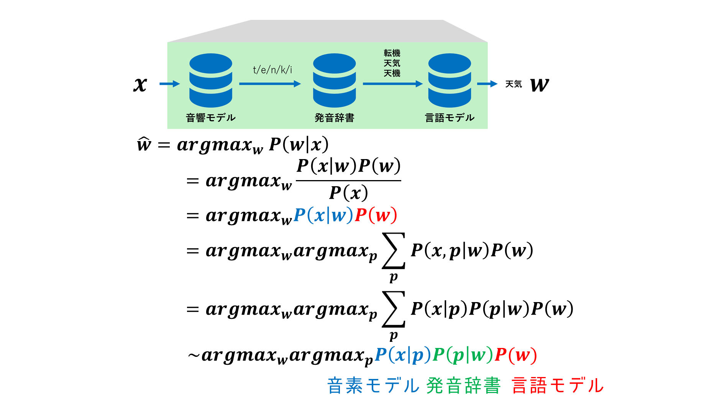

このように，音声の最小単位である音素を考慮することで融通を効かせているのが音声認識のモデルです．

ここで，音声認識の種類について以下に示します．

|名称|説明|モデルの式|
|-:|-:|:-|
|孤立単語認識|1単語だけ発話された内容を認識|$P(x\|p)P(p\|w)$|
|連続単語認識|発話された文章を認識|$P(x\|p)P(p\|w)P(w)$|

孤立単語認識の言語モデルを考えると1単語の出現確率を考えることになりますが，どの単語も出現確率は同じですよね．  
ですので，$P(w)=1$として良いことになっているため，連続と孤立で式が違ってきます．(=計算コストも低い)

## 【補足】2-4 データセットの準備の仕方

モデルはデータセットを学習することで作成します．この時，全部を学習させるわけではなく，いくつかの種類に分けて学習させることがほとんどです．

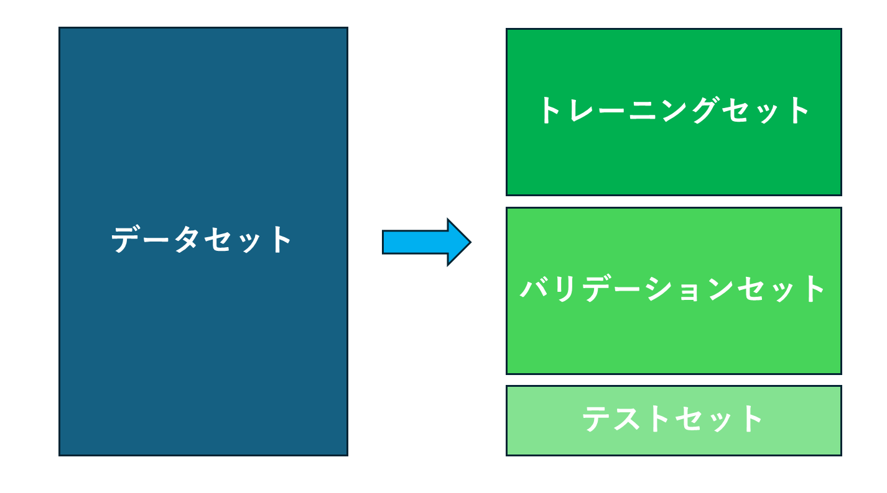

|名称|説明|
|-:|-:|
|トレーニングセット|モデルの学習のために利用．基本となるモデルを構築する．|
|バリデーションセット|係数やパラメータを調整するために利用．この時のパラメータを「ハイパーパラメータ」と呼ぶ．|
|テストセット|上記2つで調整後，精度を確認するために利用．学習には使用しない．|

このデータセットの利用方法は色んな所で用いられるので頭に入れておくと良いです．

## 課題

成果物として以下の課題に取り組み，指定の箇所に保存しておくこと．  
GitHub に保存しておくことをオススメしておきます．

### Task 2-1 確率の基礎知識

`tasks/02basic/task2-1.png`に記載の問題を解いてください．  
紙とペンを用いて解き，それを写真に撮って`ans2-1.png`としても良い．  
メモ帳にある程度の導出と答えを書き，`ans2-1.txt`としても良い．  
どちらの方法でも構わないので`tasks/02basic/ans2-1.***`の形式で保存しておくこと．

### Task 2-2 確率に関する基礎定理

以下のリンクを踏んで，パラメータに関する3つの推定方法の理解を深めなさい．  
[https://qiita.com/jyori112/items/80b21422b15753a1c5a4](https://qiita.com/jyori112/items/80b21422b15753a1c5a4)

成果物として，最尤推定・MAP推定・ベイズ推定の3つを比較した時のあなたの所感を`tasks/02basic/task2-2.txt`に書きなさい．

※ $argmax_xf(x)$とは$f(x)$を最大化する$x$の集合のことです．  
分かりやすく言うと$f(x)$を最大化する$x$すべてを求める，という意味です．  
参考 : [https://manabitimes.jp/math/1215](https://manabitimes.jp/math/1215)

### Task 2-3 音響モデルと言語モデル + データセットの準備の仕方

次の単語や問いを自分なりの理解で説明してください．  
提出場所は`tasks/02basic/task2-3.txt`を用意しておいたのでそこに書き込むこと．

1. なぜ音響モデルを細かくする必要があるのか
2. 孤立単語認識と連続単語認識は学習の面でどのような違いがあるか
3. バリデーションセット
4. クロスバリデーション (本資料には載せてないので調べてみましょう)

## 【オマケ】 定理の証明

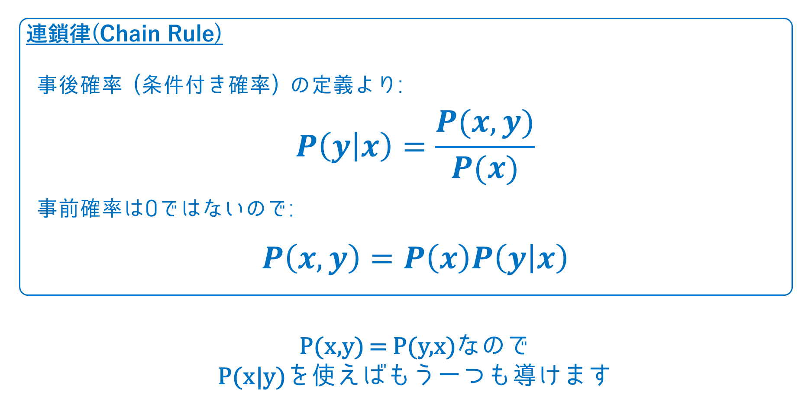

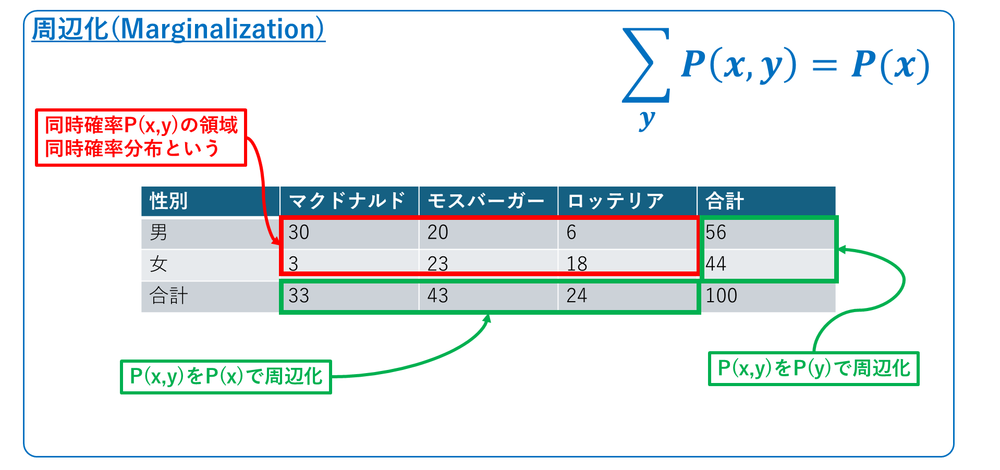

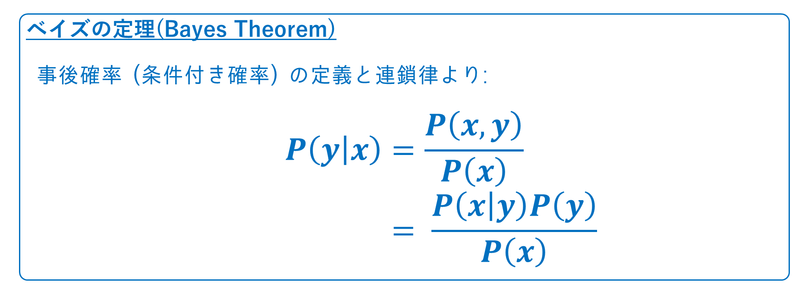

[<- 01 音声認識とは？](./01intro.md) | [-> 03 音声処理の基礎と特徴量抽出](./03features.md)
