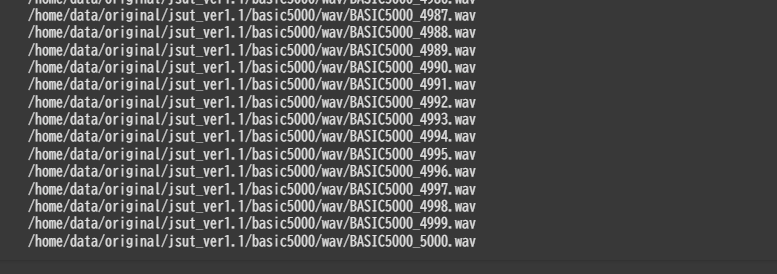

# 03 音声処理の基礎と特徴量抽出

音声処理の基礎編ということで，実際にデータを触ってもらい，そこから様々な特徴量に触れてもらいます．  
※ GPU が無いことを想定して Google Colaboratory で作業します．  
※ コーディングはコピペではなく，写経してください．

## 3-1 データの準備

ネット上には機械学習のための様々なデータセットが落ちています．  
今回はその中でも，「JUSTコーパス」というデータセットを使用します．

まずは [Google Colaboratory](https://colab.google/) にアクセスし，左上の「Open Colab」をクリックします．


すると「ノートブックを開く」と出てくるので下の方の「ノートブックを新規作成」をクリックします．


このような画面になったら準備完了です．

初めに，必要なライブラリのインストールから行います．  
次のように書いてください．

```sh
!pip install numpy
!pip install matplotlib
!apt install sox libsox-fmt-all
!pip install sox
!pip install pyyaml
```

色んなログが出てきますが，以下のようにエラーが出なければ成功と判断してください．


ここからはお手本のコードに従ってコーディングを行っていきましょう．  
コードブロックの上の方をマウスオーバーして「＋テキスト」をクリックし，次のように記述しましょう．


まず，必要なライブラリをインポートしていきましょう．  
今回は以下の3つのライブラリをインポートします．

```py
from urllib.request import urlretrieve  # ファイルをダウンロードするためのモジュール
import zipfile                          # zipファイルを展開するためのモジュール
import os                               # OSモジュール (ファイルやフォルダ操作のため)
```

ダウンロードするデータセットは URL からダウンロードできます．  
また，大体の場合は容量が大きいので ZIP などで圧縮されています．  
よって，「URLアクセス -> 展開 -> 元のzip削除」という流れを記述することになります．

今回は音声ファイルだけでなく，教師データと呼ばれるラベルデータもダウンロードします．

```py
# データの置き場を定義
data_dir = '/home/data/original'

# ディレクトリdata_dirが存在しない場合は作成する
os.makedirs(data_dir, exist_ok=True)

# 音声ファイル(jsutコーパス. zip形式)をダウンロード
data_archive = os.path.join(data_dir, 'jsut-data.zip')
print('download jsut-data start')
urlretrieve('http://ss-takashi.sakura.ne.jp/corpus/jsut_ver1.1.zip', 
            data_archive)
print('download jsut-data finished')

# ダウンロードしたデータを展開する
print('extract jsut-data start')
with zipfile.ZipFile(data_archive) as data_zip:
    data_zip.extractall(data_dir)
print('extract jsut-data finished')

# zipファイルを削除する
os.remove(data_archive)

# jsutコーパスのラベルデータをダウンロード
label_archive = os.path.join(data_dir, 'jsut-label.zip')
print('download jsut-label start')
urlretrieve('https://github.com/sarulab-speech/jsut-label/archive/master.zip',
            label_archive)
print('download jsut-label finished')

# ダウンロードしたデータを展開する
print('extract jsut-label start')
with zipfile.ZipFile(label_archive) as label_zip:
    label_zip.extractall(data_dir)
print('extract jsut-label finished')

# zipファイルを削除する
os.remove(label_archive)

print('all processes finished')
```

以上の処理を記述すると Colab ではこんな感じになると思います．  
ここまで出来たら一度実行してみましょう．コードブロックの左上に再生ボタンみたいな物があるのでそれをクリックします．(2分30秒くらいかかります)


左側のフォルダマークをクリックし，`/home/data/original`を見ると2種類のデータセットがダウンロードされています．


このようにファイルダウンロードやフォルダ作成等もプログラムで書くことが出来ます．

ダウンロードした音源を1つ聞いて見ましょう．  
音源は`/home/data/original/jsut_ver1.1/basic5000/wav/`に5000個あります．  
そのうちの1つである`basic5000_0001.wav`をダウンロードして聞いてみましょう．  
「水をマレーシアから買わなくてはならないのです」という~~意味の分からない~~言葉が聞こえたと思います．

---

さて，ダウンロードしたデータをそのまま使ってもいいのですが，学習しやすいように前処理を行います．  
まずは，「音源から取ってくる周波数を下げる」という処理を行います．  
機械で音声を取り扱う時，連続した波形データを取得することは出来ません．  
点の集合で取ってくる必要があります．(数学の言葉で言うと「連続ではなく離散的にデータを取得する」と言います)


今回ダウンロードしたデータはサンプリング周波数が48kHzのデータです．これだと情報量が多く，扱いにくいです．  
そこで，サンプリング周波数を下げて適切な情報量にする「ダウンサンプリング」を行います．

ダウンサンプリングの処理を記述するために「＋テキスト」で以下のようにしておきましょう．


元のデータを変換し，別のデータとして保存する処理を記述します．  
処理は以下のようになります．

```py
import sox  # サンプリング周波数を変換するためのモジュール(sox)
import os   # osモジュール

# wavファイルが展開されたディレクトリ
original_wav_dir = '/home/data/original/jsut_ver1.1/basic5000/wav'

# フォーマット変換したwavファイルを出力するディレクトリ
out_wav_dir = '/home/data/wav'

# wavデータのリストを格納するディレクトリ
out_scp_dir = '/home/data/label/all'

# 出力ディレクトリが存在しない場合は作成する
os.makedirs(out_wav_dir, exist_ok=True)
os.makedirs(out_scp_dir, exist_ok=True)

# soxによる音声変換クラスを呼び出す
tfm = sox.Transformer()
# サンプリング周波数を 16000Hz に変換するよう設定する
tfm.convert(samplerate=16000)

# wavデータのリストファイルを書き込みモードで開き，以降の処理を実施する
with open(os.path.join(out_scp_dir, 'wav.scp'), mode='w') as scp_file:
    # BASIC5000_0001.wav ~ BASIC5000_5000.wav に対して処理を繰り返し実行
    for i in range(5000):
        filename = 'BASIC5000_%04d' % (i+1)
        # 変換元のオリジナルデータ (48000Hz) のファイル名
        wav_path_in = os.path.join(original_wav_dir, filename+'.wav')
        # 変換後のデータ (16000Hz) の保存ファイル名
        wav_path_out = os.path.join(out_wav_dir, filename+'.wav')

        print(wav_path_in)
        # ファイルが存在しない場合はエラー
        if not os.path.exists(wav_path_in):
            print('Error: Not found %s' % (wav_path_in))
            exit()

        # サンプリング周波数の変換と保存を実行する
        tfm.build_file(input_filepath=wav_path_in, 
                        output_filepath=wav_path_out)

        # wavファイルのリストを書き込む
        scp_file.write('%s %s\n' % 
                        (filename, os.path.abspath(wav_path_out)))
```

それでは実行してみましょう！5000個のデータをダウンサンプリングしているためそこそこ時間がかかります．



ダウンロードして聞いてみても違いは分からないかもしれませんが，ファイル容量を見てみると300kb->100kbと軽くなってます．


---

今度はラベルに対して前処理を行っていきます．  
`/home/data/original/jsut-label-master/text_kana/basic5000.yaml`がラベルデータになります．  
以下に抜粋したものを示します．

```yaml
BASIC5000_0001:
  text_level0: 水をマレーシアから買わなくてはならないのです。
  kana_level0: みずをまれーしあからかわなくてわならないのです
  text_level1: 水をマレーシアから買わなくてはならないのです。
  text_level2: 水をマレーシアから買わなくてはならないのです。
  kana_level2: みずをまれーしあからかわなくてわならないのです
  kana_level3: みずをまれーしあからかわなくてわならないのです
  phone_level3: m-i-z-u-o-m-a-r-e-e-sh-i-a-k-a-r-a-k-a-w-a-n-a-k-u-t-e-w-a-n-a-r-a-n-a-i-n-o-d-e-s-u
BASIC5000_0002:
  text_level0: 木曜日、停戦会談は、何の進展もないまま終了しました。
  kana_level0: もくよーび、てーせんかいだんわ、なんのしんてんもないまましゅーりょーしました
  text_level1: 木曜日、停戦会談は、何の進展もないまま終了しました。
  text_level2: 木曜日、停戦会談は、何の進展もないまま終了しました。
  kana_level2: もくよーび、てーせんかいだんわ、なんのしんてんもないまましゅーりょーしました
  kana_level3: もくよーび、てーせんかいだんわ、なんのしんてんもないまましゅーりょーしました
  phone_level3: m-o-k-u-y-o-o-b-i-pau-t-e-e-s-e-N-k-a-i-d-a-N-w-a-pau-n-a-N-n-o-sh-i-N-t-e-N-m-o-n-a-i-m-a-m-a-sh-u-u-ry-o-o-sh-i-m-a-sh-i-t-a
```

音源で話されている正解データが様々な形式で入っています．  
モデルの学習に使いやすいように，これらを「漢字を含めたデータ・ひらがな・音素」の形式にし，さらにスペース区切りにします．  
処理は以下のようになります．

「＋テキスト」で「ラベルデータの整形」と書いたらその下に以下のコードを書きましょう．

```py
import yaml     # yamlデータを読み込むためのモジュール
import os       # osモジュール
    
# ダウンロードしたラベルデータ(yaml形式)
original_label = \
'/home/data/original/jsut-label-master/text_kana/basic5000.yaml'

# ラベルのリストを格納する場所
out_label_dir = '/home/data/label/all'

# 出力ディレクトリが存在しない場合は作成する
os.makedirs(out_label_dir, exist_ok=True)

# ラベルデータを読み込む
with open(original_label, mode='r') as yamlfile:
    label_info = yaml.safe_load(yamlfile)

# キャラクター/かな/音素のラベルファイルを書き込みモードで開く
with open(os.path.join(out_label_dir, 'text_char'), 
            mode='w') as label_char, \
            open(os.path.join(out_label_dir, 'text_kana'), 
            mode='w') as label_kana, \
            open(os.path.join(out_label_dir, 'text_phone'), 
            mode='w') as label_phone:
    # BASIC5000_0001 ~ BASIC5000_5000 に対して処理を繰り返し実行
    for i in range(5000):
        # 発話ID
        filename = 'BASIC5000_%04d' % (i+1)
        
        # 発話ID が label_info に含まれない場合はエラー
        if not filename in label_info:
            print('Error: %s is not in %s' % (filename, original_label))
            exit()

        # キャラクターラベル情報を取得
        chars = label_info[filename]['text_level2']
        # '、'と'。'を除去
        chars = chars.replace('、', '')
        chars = chars.replace('。', '')

        # かなラベル情報を取得
        kanas = label_info[filename]['kana_level3']
        # '、'を除去
        kanas = kanas.replace('、', '')

        # 音素ラベル情報を取得
        phones = label_info[filename]['phone_level3']

        # キャラクターラベルファイルへ，1文字ずつスペース区切りで書き込む
        # (' '.join(list) は，リストの各要素にスペースを挟んで，1文にする)
        label_char.write('%s %s\n' % (filename, ' '.join(chars)))

        # かなラベルファイルへ，1文字ずつスペース区切りで書き込む
        label_kana.write('%s %s\n' % (filename, ' '.join(kanas)))

        # 音素ラベルは，'-'をスペースに置換して書き込む
        label_phone.write('%s %s\n' % (filename, phones.replace('-',' ')))
```

`text_char`や`text_kana`を見てみると整形済みのラベルを見ることが出来ます．

```txt
BASIC5000_0001 水 を マ レ ー シ ア か ら 買 わ な く て は な ら な い の で す
BASIC5000_0002 木 曜 日 停 戦 会 談 は 何 の 進 展 も な い ま ま 終 了 し ま し た
BASIC5000_0003 上 院 議 員 は 私 が デ ー タ を ゆ が め た と 告 発 し た
BASIC5000_0004 １ 週 間 し て そ の ニ ュ ー ス は 本 当 に な っ た
BASIC5000_0005 血 圧 は 健 康 の パ ロ メ ー タ ー と し て 重 要 で あ る
BASIC5000_0006 週 に 四 回 フ ラ ン ス の 授 業 が あ り ま す
BASIC5000_0007 許 可 書 が な け れ ば こ こ へ は 入 れ な い
BASIC5000_0008 大 声 で 泣 き な が ら 女 の 子 は 母 親 を 探 し て い た
```

---

最後にデータセットの分割を行います．  
[2-4 データセットの準備の仕方](./02basic.md#補足2-4-データセットの準備の仕方)で述べたようにデータセットを以下の3つに分けます．

1. トレーニングセット
2. バリデーションセット
3. テストセット

「＋テキスト」で「データセットの分割」と書いたうえで以下の処理を記述しましょう．

```py

# ここでは，以下のように分割します．
# BASIC5000_0001~0250 : テストセット
# BASIC5000_0251~0500 : バリデーションセット
# BASIC5000_0501~1500 : トレーニングセット（小）
# BASIC5000_0501~5000 : トレーニングセット（大）


import os

# 全データが記述されているリストの置き場
all_dir = '/home/data/label/all'

# テストセットが記述されたリストの出力先
out_eval_dir = '/home/data/label/test'
# バリデーションセットが記述されたリストの出力先
out_dev_dir = '/home/data/label/dev'
# トレーニングセット（小）が記述されたリストの出力先
out_train_small_dir = '/home/data/label/train_small'
# トレーニングセット（大）が記述されたリストの出力先
out_train_large_dir = '/home/data/label/train_large'

# 各出力ディレクトリが存在しない場合は作成する
for out_dir in [out_eval_dir, out_dev_dir, 
                out_train_small_dir, out_train_large_dir]:
    os.makedirs(out_dir, exist_ok=True)

# wav.scp, text_char, text_kana, text_phoneそれぞれに同じ処理を行う
for filename in ['wav.scp', 'text_char', 
                    'text_kana', 'text_phone']:
    # 全データを読み込みモードで，/評価/開発/学習データリストを書き込みモードで開く
    with open(os.path.join(all_dir, filename), 
                mode='r') as all_file, \
                open(os.path.join(out_eval_dir, filename), 
                mode='w') as eval_file, \
                open(os.path.join(out_dev_dir, filename), 
                mode='w') as dev_file, \
                open(os.path.join(out_train_small_dir, filename), 
                mode='w') as train_small_file, \
                open(os.path.join(out_train_large_dir, filename), 
                mode='w') as train_large_file:
        # 1行ずつ読み込み，評価/開発/学習データリストに書き込んでいく
        for i, line in enumerate(all_file):
            if i < 250:
                # 1~250: 評価データリストへ書き込み
                eval_file.write(line)
            elif i < 500:
                # 251~500: 開発データリストへ書き込み
                dev_file.write(line)
            else:
                # 501~5000: 学習（大）データリストへ書き込み
                train_large_file.write(line)
                if i < 1500:
                    # 501～1500: 学習（小）データリストへ書き込み
                    train_small_file.write(line)
```

実行が完了すると以下のようにデータセットが分割されるはずです．


## 3-2 音声ファイルの読み込み

さて，データセットを用意できたので，次はコードで音声ファイルを読み込んでいきましょう．  
今回は`BASIC5000_0001.wav`の情報と波形を出力してみます．

```py
import wave # wavファイルを読み込むモジュール
import numpy as np
import matplotlib.pyplot as plt

# 音声ファイルの読み込み
fname = "/home/data/wav/BASIC5000_0001.wav"
wave_file = wave.open(fname, 'r')

# 音声の基本情報
sample_width = wave_file.getsampwidth()  # 1サンプルのバイト数
fs = wave_file.getframerate()  # サンプリング周波数
nframes = wave_file.getnframes()  # 総フレーム数
nchannels = wave_file.getnchannels()  # チャンネル数

print(f"sample_width: {sample_width} byte")
print(f"fs: {fs} Hz")
print(f"nframes: {nframes}")
print(f"nchannels: {nchannels}")

# 波形データの読み込み
frames = wave_file.readframes(nframes)  # 全フレームを取得
wave_file.close()

# NumPy 配列に変換
wave_data = np.frombuffer(frames, dtype=np.int16)  # 16bit PCM の場合
if nchannels == 2:  
    wave_data = wave_data.reshape(-1, 2)  # ステレオなら (N, 2) に変形

# 時間軸を計算（秒単位に変換）
time = np.linspace(0, nframes / fs, num=nframes)

# プロット
fig, ax = plt.subplots(figsize=(12, 4))

ax.plot(time, wave_data[:, 0] if nchannels == 2 else wave_data, label="waveform")

# **軸ラベル**
ax.set_xlabel("Time [sec]")
ax.set_ylabel("value")

# **X軸スケールを 0.0 ~ 3.0 秒に変換（0.5 秒刻み）**
ax.set_xticks(np.arange(0.0, 3.5, 0.5))
ax.set_xlim(0.0, 3.0)

plt.legend()
plt.show()

```

実行すると以下のようになるかと思います．


出力された情報は基本的な情報にはなりますが，`fs`だけ見てくれればいいです．  
これはサンプリング周波数を表していて，ダウンサンプリングの結果16kHzになっているので，問題なく処理が出来ていることが分かります．

## 3-3 フーリエ変換を使った音声の周波数分解

さて，機械に音声を取り込むことは出来たものの，波形や基本的な情報だけではなっている音を把握しづらいです．  
その原因の1つに波形の横軸が時間であることが挙げられます．  
得られた波形は「何秒の時点でどれくらいの量の入力があった」という事しか分からないのです．

そこで，横軸が時間である波形を横軸が周波数である波形に分解する方法を取ります．  
方法の1つとして**フーリエ変換**という方法があります．

フーリエ変換とはいっても色んな種類があります．今回は「離散フーリエ変換」を使います．  
式を一応お見せしますが，全く覚えなくてよいです．(適宜参照していい部類の式だと思ってます)


覚えてほしいことは時間領域を周波数領域に変換する際は「フーリエ変換」，周波数領域を時間領域に変換する際は「逆フーリエ変換」を使う，ということです．

ここで用語の整理をします．

|用語|説明|
|:-|:-|
|スペクトル|$y(k)$のこと|
|振幅スペクトル|$\|y(k)\|$のこと|
|位相スペクトル|$\angle y(k)$のこと|
|パワースペクトル|$\|y(k)\|^2$のこと|

ここら辺の単語はそのうち出てきますので「どこで出て来たか」程度は覚えておいてください．  
フーリエ変換の際に得られる情報です．

非常に分かりやすい動画の視聴を [Task3-3](#task3-3-フーリエ変換を使った音声の周波数分解) にしたのでこの章だけは先に課題を終わらせてください．

---

さて，ここからは実際にコーディングしてフーリエ変換を行ってみましょう．  
プログラムではフーリエ変換の中でも高速に動作する「高速フーリエ変換 (FFT)」と呼ばれるアルゴリズムを利用します．

```py
import wave                     # wavデータを読み込むためのモジュール(wave)をインポート
import numpy as np              # 数値演算用モジュール(numpy)をインポート
import matplotlib.pyplot as plt # プロット用モジュール(matplotlib)をインポート

# 開くwavファイル
wav_file = '/home/data/wav/BASIC5000_0001.wav'

# 分析する時刻．BASIC5000_0001.wav では，
# 以下の時刻は音素"o"を発話している
target_time = 0.58
target_time = 0.74

# FFT(高速フーリエ変換)を行う範囲のサンプル数
# 2のべき乗である必要がある
fft_size = 1024

# wavファイルを開き，以降の処理を行う
with wave.open(wav_file) as wav:
    # サンプリング周波数 [Hz] を取得
    sampling_frequency = wav.getframerate()

    # wavデータを読み込む
    waveform = wav.readframes(wav.getnframes())

    # 読み込んだデータはバイナリ値(16bit integer)
    # なので，数値(整数)に変換する
    waveform = np.frombuffer(waveform, dtype=np.int16)

# 分析する時刻をサンプル番号に変換
target_index = np.int32(target_time * sampling_frequency)

# FFTを実施する区間分の波形データを取り出す
frame = waveform[target_index: target_index + fft_size]

# FFTを実施する
spectrum = np.fft.fft(frame)

# 振幅スペクトルを得る
absolute = np.abs(spectrum)

# 振幅スペクトルは左右対称なので，左半分までのみを用いる
absolute = absolute[:np.int32(fft_size/2) + 1]

# 対数を取り，対数振幅スペクトルを計算
# 対数に0を入れると負の無限大になるため微小な値を足す (フロアリング処理と言います)
log_absolute = np.log(absolute + 1E-7)

#
# 時間波形と対数振幅スペクトルをプロット
#

# プロットの描画領域を作成
plt.figure(figsize=(10,10))

# 描画領域を縦に2分割し，
# 上側に時間波形をプロットする
plt.subplot(2, 1, 1)

# 横軸(時間軸)を作成する
time_axis = target_time \
            + np.arange(fft_size) / sampling_frequency

# 時間波形のプロット
plt.plot(time_axis, frame)

# プロットのタイトルと，横軸と縦軸のラベルを定義
plt.title('waveform')
plt.xlabel('Time [sec]')
plt.ylabel('Value')

# 横軸の表示領域を分析区間の時刻に制限
plt.xlim([target_time, 
            target_time + fft_size / sampling_frequency])

# 2分割された描画領域の下側に
# 対数振幅スペクトルをプロットする
plt.subplot(2, 1, 2)

# 横軸(周波数軸)を作成する
freq_axis = np.arange(np.int32(fft_size/2)+1) \
            * sampling_frequency / fft_size

# 対数振幅スペクトルをプロット
plt.plot(freq_axis, log_absolute)

# プロットのタイトルと，横軸と縦軸のラベルを定義
plt.title('log-absolute spectrum')
plt.xlabel('Frequency [Hz]')
plt.ylabel('Value')

# 横軸の表示領域を0～最大周波数に制限
plt.xlim([0, sampling_frequency / 2]) 

# プロットを出力する
plt.show()

```


こんな感じの波形が得られたかと思います．  
上がオリジナルで下が変換後の波形となります．

周波数の波形を見てみると，周波数が低い部分の値が大きくなっていることが分かります．  
このことから，低い音の割合が高いことが読み取れるわけです．

## 3-4 短時間フーリエ変換によるスペクトログラムの作成

実は 3-3 で行っていたフーリエ変換にはある問題があります．  
それは，「時間に関する情報が不明である」という問題です．
先ほどの例では音素で「o」と言っていそうな部分に対して処理を行っていましたが，決まった時間で区切りたいです．

そこで，短い時間ごとに音声を区切ってフーリエ変換を行います．  
このフーリエ変換のことを「短時間フーリエ変換」と言います．


どのように波形を切り出すかというと**窓関数**と呼ばれる関数を用います．  
その中でも「ハミング窓関数」と呼ばれる関数を用います．


特徴は以下の2つです．

1. 始端と終端が0に近づくため，区切ってもノイズになりにくい
2. 終端がN-1になる (画像は N=2 の時のハミング窓関数)

```py
import wave
import numpy as np
import matplotlib.pyplot as plt

# 開くwavファイル
wav_file = '/home/data/wav/BASIC5000_0001.wav'

# 分析する時刻．BASIC5000_0001.wav では，
# 以下の時刻は音素"o"を発話している
target_time = 0.58

# FFT(高速フーリエ変換)を行う範囲のサンプル数
# 2のべき乗である必要がある
fft_size = 1024

# wavファイルを開き、以降の処理を行う
with wave.open(wav_file) as wav:
    # サンプリング周波数 [Hz] を取得
    sampling_frequency = wav.getframerate()

    # wavデータを読み込む
    waveform = wav.readframes(wav.getnframes())

    # 読み込んだデータはバイナリ値(16bit integer)
    # なので，数値(整数)に変換する
    waveform = np.frombuffer(waveform, dtype=np.int16)

# 分析する時刻をサンプル番号に変換
target_index = np.int32(target_time * sampling_frequency)

# FFTを実施する区間分の波形データを取り出す
frame = waveform[target_index: target_index + fft_size]

frame_emp = np.convolve(frame,np.array([1.0, -0.97]), mode='same')
# numpyの畳み込みでは0番目の要素が処理されない(window[i-1]が存在しないので)ため，
# window[0-1]をwindow[0]で代用して処理する
frame_emp[0] -= 0.97*frame_emp[0]

h = np.zeros(fft_size)
h[0] = 1.0
h[1] = -0.97

frame = frame * np.hamming(fft_size)
frame_emp = frame_emp * np.hamming(fft_size)

# FFTを実施する
spectrum = np.fft.fft(frame)
spectrum_emp = np.fft.fft(frame_emp)
spectrum_h = np.fft.fft(h)

# 振幅スペクトルを得る
absolute = np.abs(spectrum)
absolute_emp = np.abs(spectrum_emp)
absolute_h = np.abs(spectrum_h)

# 振幅スペクトルは左右対称なので，左半分までのみを用いる
absolute = absolute[:np.int32(fft_size/2) + 1]
absolute_emp = absolute_emp[:np.int32(fft_size/2) + 1]
absolute_h = absolute_h[:np.int32(fft_size/2) + 1]

# 対数を取り、対数振幅スペクトルを計算
log_absolute = np.log(absolute + 1E-7)
log_absolute_emp = np.log(absolute_emp + 1E-7)
log_absolute_h = np.log(absolute_h + 1E-7)

#
# 時間波形と対数振幅スペクトルをプロット
#

# プロットの描画領域を作成
plt.figure(figsize=(10,10))

# 2分割された描画領域の下側に
# 対数振幅スペクトルをプロットする
plt.subplot(3, 1, 1)

# 横軸(周波数軸)を作成する
freq_axis = np.arange(np.int32(fft_size/2)+1) \
            * sampling_frequency / fft_size

# 対数振幅スペクトルをプロット
plt.plot(freq_axis, log_absolute, color='k')

# プロットのタイトルと、横軸と縦軸のラベルを定義
#plt.title('log-absolute spectrum without pre-emphasis (x)')
plt.xlabel('Frequency [Hz]')
plt.ylabel('Value')

# 横軸の表示領域を0～最大周波数に制限
plt.xlim([0, sampling_frequency / 2]) 
plt.ylim([0,15])

# 2分割された描画領域の下側に
# 対数振幅スペクトルをプロットする
plt.subplot(3, 1, 2)

# 横軸(周波数軸)を作成する
freq_axis = np.arange(np.int32(fft_size/2)+1) \
            * sampling_frequency / fft_size

# 対数振幅スペクトルをプロット
plt.plot(freq_axis, log_absolute_emp, color='k')

# プロットのタイトルと、横軸と縦軸のラベルを定義
#plt.title('log-absolute spectrum with pre-emphasis (x_emp)')
plt.xlabel('Frequency [Hz]')
plt.ylabel('Value')

# 横軸の表示領域を0～最大周波数に制限
plt.xlim([0, sampling_frequency / 2]) 
plt.ylim([0,15])

plt.subplot(3, 1, 3)

# 横軸(周波数軸)を作成する
freq_axis = np.arange(np.int32(fft_size/2)+1) \
            * sampling_frequency / fft_size

# 対数振幅スペクトルをプロット
plt.plot(freq_axis, log_absolute_emp - log_absolute, linestyle='dashed', color='k')
plt.plot(freq_axis, log_absolute_h, color='k')

# プロットのタイトルと、横軸と縦軸のラベルを定義
#plt.title('log-absolute spectra of pre-emphasis filter (h) and (x_emp - x)')
plt.xlabel('Frequency [Hz]')
plt.ylabel('Value')

# 横軸の表示領域を0～最大周波数に制限
plt.xlim([0, sampling_frequency / 2]) 

# プロットを出力する
plt.show()

```

## 3-5 対数メルフィルタバンク特徴量

## 3-6 メル周波数ケプストラム特徴量

## 3-7 特徴量の平均と標準偏差の計算

## 課題

### Task3-1 データの準備

お手本と同じ操作をしているかを確認するために以下の条件で`/home/data`の構成をスクリーンショットで保存しなさい．  
保存したら`tasks/03features/task3-1.png`の形式で保存すること．

1. `label`フォルダの矢印をクリックして中を見れるようにすること (`all`や`dev`が見えるように)
2. `wav`フォルダの矢印をクリックして中を見れるようにすること (`BASIC5000_**.wav`が4個くらい見えるように)
3. `original`は閉じてて良い

### Task3-2 音声ファイルの読み込み

動作確認のために`BASIC5000_2025.wav`の波形を`tasks/03features/task3-2.png`として保存しなさい．

### Task3-3 フーリエ変換を使った音声の周波数分解

フーリエ変換の概念を理解するために以下の動画を視聴しなさい．  
成果物として，`tasks/03features/task3-3.txt`の問題に回答せよ．

[https://youtu.be/fGos3wrKeHY?si=YhltzMW-NbhYgBXr](https://youtu.be/fGos3wrKeHY?si=YhltzMW-NbhYgBXr)
